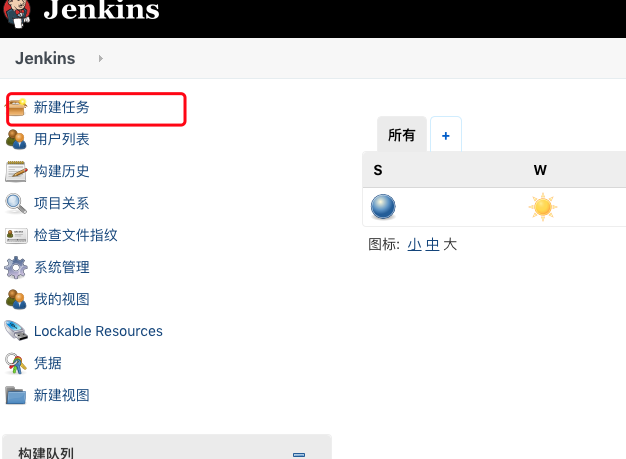
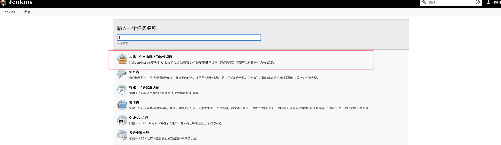
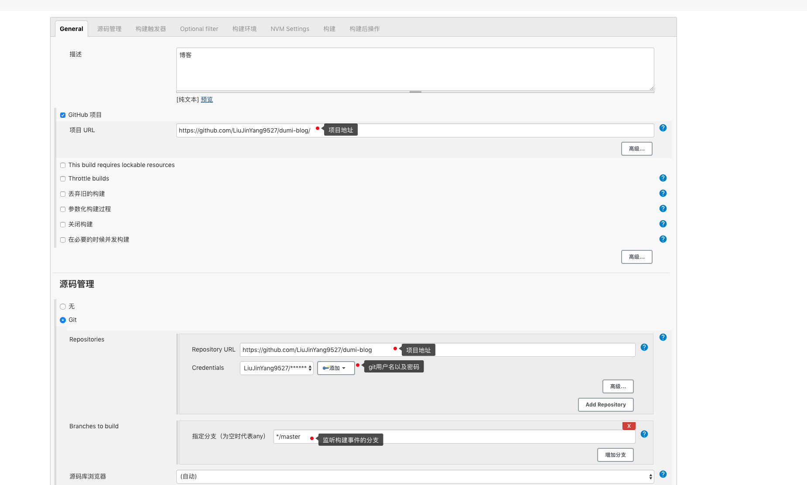
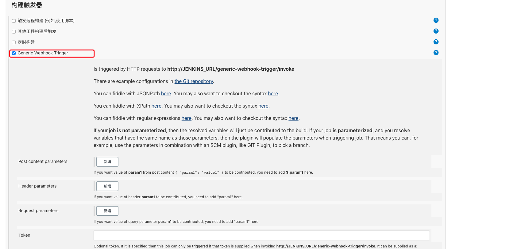
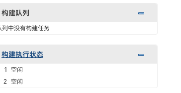
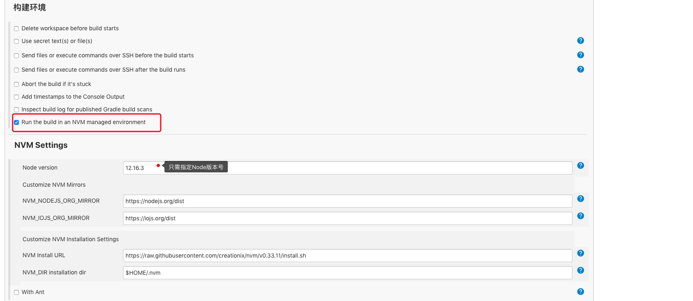
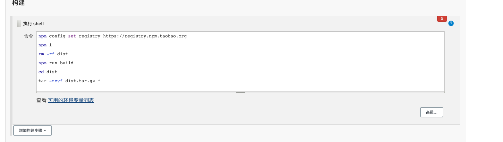
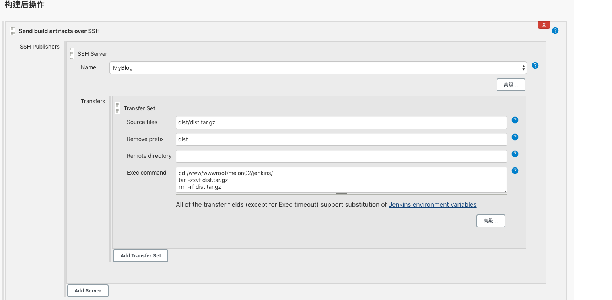

# Jenkins

[中文文档](https://www.jenkins.io/zh/) 

[Docker安装Jenkins](https://www.jenkins.io/doc/book/installing/#docker)

## 准备

- 创建一个 github 项目（gitlab、码云也行）
- 有一台云服务器，最起码 1 核 2g 以上，配置好 Java 环境

## 安装 Jenkins

### 第一步

进入 Jenkins 官网，找到对应平台的安装方法，如下图，我的服务器系统为 Linux，CentOS7，即为下图

```jsx | inline
import React from 'react';
import Png from '../../assets/WechatIMG7.png';

export default () => ;
```

然后登陆服务器，进行服务器配置

### 第二步

登陆自己的服务器，开始配置

#### 安装 Java 环境以及 Git

```shell
yum install java

yum install git
```

#### 安装 Jenkins 包

首先按照 Jenkis 官网下载引导所示，添加 Jenkis 源
https://pkg.jenkins.io/redhat-stable/

```shell

sudo wget -O /etc/yum.repos.d/jenkins.repo https://pkg.jenkins.io/redhat-stable/jenkins.repo

sudo rpm --import https://pkg.jenkins.io/redhat-stable/jenkins.io.key

```

然后安装

```shell
yum install jenkins
```

> 此时可能会遇到 jenkins 安装错误，可尝试以下几种方式

- 清楚 yum 源缓存 `yum clean all` 以及`rm -rf /var/cache/yum/*` 这两条命令
- 碰到其他问题再更新

## 启动 Jenkins

```shell
service jenkins restart
```

当命令行出现

```
Restarting jenkins (via systemctl):     [ok]
```

代表启动成功。

然后，通过浏览器打开 jenkins，默认端口为 8080，注意此端口是否放行
链接为：http://服务器ip:8080

### 解锁 Jenkis

首次进入 Jenkins 页面，会提示让我们输入密码进行解锁，根据页面上的密码服务器存放路径来获取密码，连接到服务器，执行

```
vim /var/lib/jenkins/secrets/initialAdminPassword
```

获取到密码，输入，点击确定

### 自定义 Jenkins

得到密码后，会让我们选择安装插件，直接选择推荐的插件，等待安装完毕

#### 创建第一个管理员账户

插件安装完毕后，创建一个管理员账户，注意保存账号密码，即可进入 Jenkins 管理页面

## 创建任务

如下图开始配置一个 Jenkins 任务



然后，创建一个自由风格的软件项目即可，任务名称随意输入


### 实现 git 钩子功能

如下所示，先配置 github 或者 gitlab 项目信息


#### 安装 Generic Webhook Trigger Plugin 插件

（系统管理-插件管理-搜索 Generic Webhook Trigger Plugin）如果可选插件列表为空，点击高级标签页，替换升级站点的 URL 为：http://mirror.xmission.com/jenkins/updates/update-center.json 

或者使用下方地址

并且点击提交和立即获取。

#####  jenkins镜像加速

Jenkins 所有镜像列表： http://mirrors.jenkins-ci.org/status.html

比如日本的镜像：
 http://mirror.esuni.jp/jenkins/
 http://ftp.yz.yamagata-u.ac.jp/pub/misc/jenkins/
 http://ftp.tsukuba.wide.ad.jp/software/jenkins/

德国的镜像：
http://jenkins.mirror.isppower.de/  
http://mirror.yandex.ru/mirrors/jenkins/

官方的镜像：http://mirrors.jenkins-ci.org/
http://archives.jenkins-ci.org/

清华大学镜像：
https://mirrors.tuna.tsinghua.edu.cn/jenkins/updates/update-center.json

#### 配置触发器

如下图，勾选即可


#### 项目仓库配置钩子

即添加 webHooks，URl 格式为：
`http://<User ID>:<API Token>@<Jenkins IP地址>:端口/generic-webhook-trigger/invoke` userid 和 api token 在 jenkins 的系统管理-管理用户-admin-设置里

### 测试钩子

配置完成后，即可进行测试
在项目对应分支进行代码提交，如果配置成功，Jenkins 队列将出现一个任务，而非空闲状态，可以点击进去，查看控制台的输入信息



## 实现自动化构建

git push 触发钩子后，jenkins 就要开始工作了，自动化的构建任务可以有很多种，比如说安装升级依赖包，单元测试，e2e 测试，压缩静态资源，批量重命名等等，无论是 npm script 还是 webpack，gulp 之类的工作流，你之前在本地能做的，在这里同样可以做。

此处只进行打包构建

### 配置 node 环境

此处可以安装 nvm wrapper 插件，插件安装方法与之前一致

安装完毕后，进行如下配置，勾选 NVM，只需填入 Node 版本号



### 添加构建脚本

如下所示


点击保存，即可进行测试。

## 实现自动化部署

- 安装插件 Publish Over SSH

- 在要部署代码的服务器上创建一个文件夹用于接收 Jenkins 传过来的代码

- Jenkins 想要往服务器上部署代码必须登录服务器才可以，这里有两种登录验证方式，一种是 ssh 验证，一种是密码验证，就像你自己登录你的服务器，你可以使用 ssh 免密登录，也可以每次输密码登录，系统管理-系统设置里找到 Publish over SSH 这一项。
  重点参数说明：

```shell
Passphrase：密码（key的密码，没设置就是空）
Path to key：key文件（私钥）的路径
Key：将私钥复制到这个框中(path to key和key写一个即可)

SSH Servers的配置：
SSH Server Name：标识的名字（随便你取什么）
Hostname：需要连接ssh的主机名或ip地址（建议ip）
Username：用户名
Remote Directory：远程目录（上面第二步建的testjenkins文件夹的路径）

高级配置：
Use password authentication, or use a different key：勾选这个可以使用密码登录，不想配ssh的可以用这个先试试
Passphrase / Password：密码登录模式的密码
Port：端口（默认22）
Timeout (ms)：超时时间（毫秒）默认300000

```

配置完成后，点击 Test Configuration 测试一下是否可以连接上，如果成功会返回 success，失败会返回报错信息，根据报错信息改正即可。

- 增加构建后操作步骤，选择 send build artificial over SSH， 参数说明：

```shell
Name:选择一个你配好的ssh服务器
Source files ：写你要传输的文件路径
Remove prefix ：要去掉的前缀，不写远程服务器的目录结构将和Source files写的一致
Remote directory ：写你要部署在远程服务器的那个目录地址下，不写就是SSH Servers配置里默认远程目录
Execcommand ：传输完了要执行的命令，
```



点击保存，然后再次进行构建测试，查看效果


## 问题
+ jenkins构建执行shell脚本时遇到权限问题

> 原因可能为当前执行的用户为jenkins

查看当前用户，执行以下命令，配置在jenkins构建shell中
```shell
echo "当前操作人"
whoami
echo "当前目录"
pwd
```

查看配置文件
```
vi /etc/sysconfig/jenkins 
```
修改JENKINS_USER="root"

最后重启Jenkins即可
```
service jenkins restart
```
